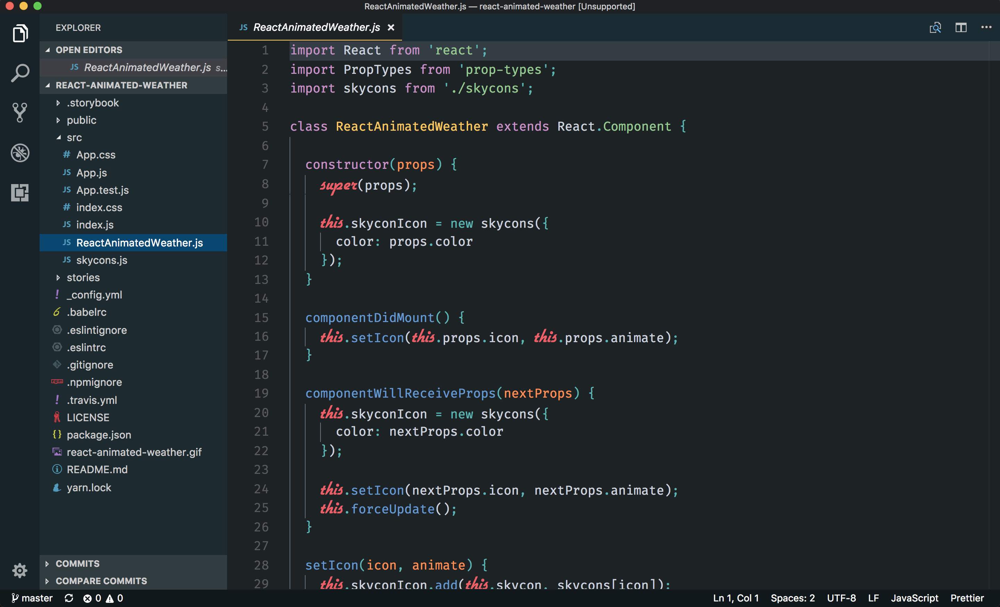

# Oceanic Darker
## A darker version of my all-time favorite oceanic


## Installation

Find the theme on marketplace here or fire up the command palette with <kbd>Ctrl</kbd> + <kbd>Shift</kbd> + <kbd>P</kbd> and enter:
```
ext install oceanic-darker
```

## Preview



## Preview Coding Environment

- **OS** macOS High Seirra
- **Primary font** [Fira Code with ligatures](https://github.com/tonsky/FiraCode)
- **Secondary font** [Flott Flott](https://www.google.co.in/url?sa=t&rct=j&q=&esrc=s&source=web&cd=1&cad=rja&uact=8&ved=0ahUKEwj0yrecovPWAhUC6Y8KHcmTCSMQFggnMAA&url=https%3A%2F%2Fwww.dafont.com%2Fflottflott.font&usg=AOvVaw1bM3uloP1gLcvFInvJnAIg)
- **Customizations** [VS Code custom CSS plugin](https://github.com/be5invis/vscode-custom-css). Add the snippet to render the secondary font correctly and hide the feedback icon

```css
.mtki {
  font-family: 'flottflott';
  font-style: normal;
  font-weight: 400;
  font-size: 1.6em;
}

.send-feedback.mask-icon {
  display: none;
}

.statusbar-item.right.__CUSTOM_CSS_JS_INDICATOR_CLS .octicon.octicon-paintcan {
  display: none;
}
```

## Bugs and Issues

Found an issue with the theme? Does it look weird with some particular code snippet? No worries, please report an [issue](https://github.com/divyanshu013/oceanic-darker/issues) with the snippet and a screenshot and I'll get back to it :grin:

## License

MIT